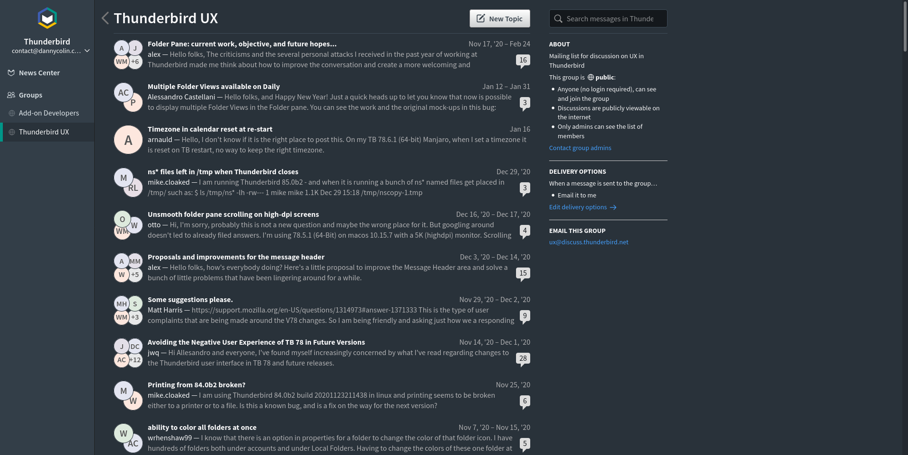

# Topicbox Dark

A Dark Theme for Topicbox

## Installation

You'll need to:

1. Install Stylus ([Firefox][stylus-ff], [Chrome][stylus-cr])
1. Install [Topicbox Dark][install-github]

## License

Copyright (c) 2021 Danny Colin

This Source Code Form is subject to the terms of the Mozilla Public License,
v. 2.0. If a copy of the MPL was not distributed with this file, You can obtain
one at http://mozilla.org/MPL/2.0/.

[install-github]: https://raw.githubusercontent.com/dannycolin/topicbox-dark/master/topicbox-dark.user.css
[stylus-cr]: https://chrome.google.com/webstore/detail/stylus-beta/apmmpaebfobifelkijhaljbmpcgbjbdo
[stylus-ff]: https://addons.mozilla.org/en-US/firefox/addon/styl-us/
